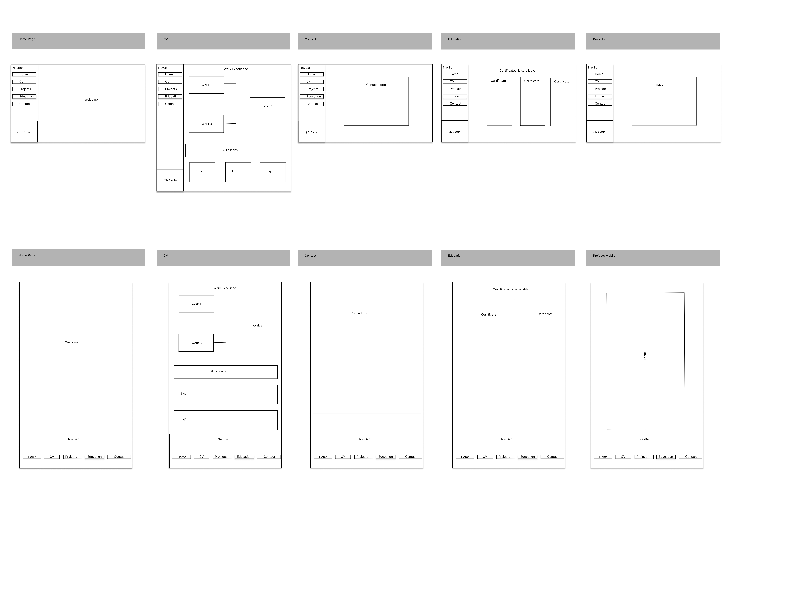

Basic HTML, CSS and JS project.

# Wireframe

# Installation

Run `npm i`

To turn on scss watcher do `npm run scss-watch`

Now with the addition of webpack things work a little different, for js compilation you should run `npm run build`
and for publishing changes in github pages you should run `npm run deploy -- -m "the msg you want"`

Source of information:

- https://www.learnhowtoprogram.com/intermediate-javascript/team-week/hosting-a-webpack-project-with-gh-pages
- https://webpack.js.org/guides/getting-started
